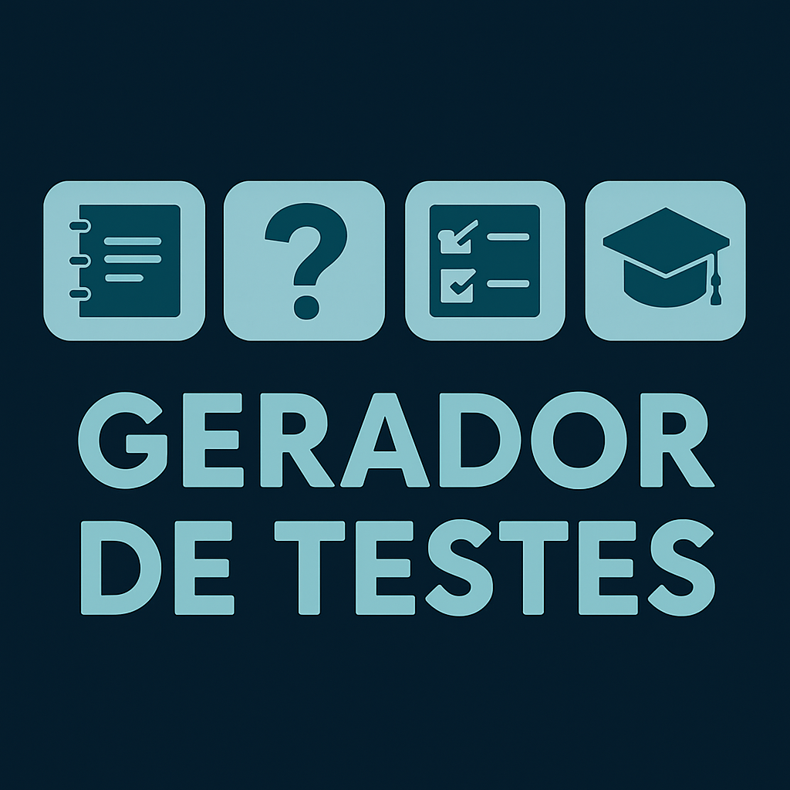

# Gerador-de-Testes



# 📌 Demonstração

## 🖥️ Tela Inicial  


## 🔍 Navegações  


## 🧠 Cadastro de Questão  


## 📝 Cadastro de Teste  


# 💡 Índice

- [Demonstração](#-demonstração)
- [Introdução](#-introdução)
- [Funcionalidades](#-funcionalidades)
- [Estrutura do Projeto](#-estrutura-do-projeto)
- [Tecnologias Usadas](#-tecnologias-usadas)
- [Commits e Convenções](#-commits-e-convenções)
- [Como rodar o projeto](#-como-rodar-o-projeto)
- [Contribuidores](#-contribuidores)
- [Mentores](#-mentores)
- [Sobre o Projeto](#-sobre-o-projeto)
- [Feedback](#-feedback)
- [Como Contribuir](#-como-contribuir)


# 📚 Introdução

O **Gerador de Testes** é uma aplicação web desenvolvida em **ASP.NET MVC** com **SQL Server**, projetada para facilitar a criação, organização e impressão de testes escolares. A plataforma permite ao usuário cadastrar disciplinas, matérias, questões e alternativas, com regras bem definidas e geração automatizada de provas e gabaritos, proporcionando agilidade e padronização ao processo de avaliação educacional.

# ✨ Funcionalidades

- 📝 **Geração de Testes Personalizados** – Criação de provas a partir de critérios como disciplina, série, quantidade de questões e sorteio aleatório.

- 🧠 **Banco de Questões** – Cadastro e gerenciamento de questões objetivas com múltiplas alternativas e indicação da correta.

- 📚 **Organização Acadêmica** – Controle de disciplinas e matérias vinculadas, organizando o conteúdo pedagógico de forma estruturada.

- ✅ **Validações Automatizadas** – Preenchimento obrigatório de campos, integridade dos dados e verificação de consistência nas questões e testes.

- 📄 **Exportação para PDF** – Geração de versões prontas para impressão do teste e do gabarito correspondente.

- 🔍 **Visualização Detalhada** – Tela de detalhes com visualização clara de todas as informações do teste, inclusive estrutura da prova.

- ♻️ **Funcionalidades Avançadas** – Duplicação de testes, exclusão segura, listagem com filtros por disciplina, série e data de criação.

- 💡 **Interface Simples e Objetiva** – Design funcional com foco na produtividade de professores e coordenadores pedagógicos.


## 🧱 Estrutura do Projeto

```text

GeradorDeTestes
│
├── 🧠 GeradorTestes.Dominio        # Entidades de negócio e regras de domínio
│   └── ModuloTeste, ModuloQuestao, ModuloAlternativa, ModuloDisciplina, ModuloMateria, Compartilhado
│
├── 💾 GeradorTestes.Infra.Dados    # Acesso a dados e repositórios (SQL Server)
│   └── Repositórios por módulo e persistência com Entity Framework
│
└── 🌐 GeradorTestes.WebApp         # Camada de apresentação (ASP.NET MVC)
    ├── Controllers                 # Lógica de controle e ações da aplicação
    ├── Views                       # Páginas Razor (cadastro, detalhes, listagem, geração de PDF)
    ├── ViewModels                  # Modelos específicos da interface
    └── wwwroot                     # Arquivos estáticos (CSS, JS, imagens)

```

- 🧠 **Dominio:** Contém as entidades centrais do sistema, como **Teste**, **Questão**, **Alternativa**, **Disciplina** e **Matéria**. Inclui regras de negócio que garantem a consistência e integridade dos dados.

- 💾 **Infra.Dados:** Responsável pela **persistência das informações**, com repositórios implementados em **Entity Framework** para leitura, gravação e atualização dos dados no banco **SQL Server**.

- 🌐 **WebApp:** Camada de apresentação construída com **ASP.NET MVC**. Inclui os **Controllers** (responsáveis pelo fluxo da aplicação), as **Views** (interfaces Razor), os **ViewModels** usados na comunicação entre backend e frontend, além dos **arquivos estáticos** necessários para estilização e comportamento.


# 🔧 Tecnologias Usadas

[](https://skillicons.dev)

Este projeto utiliza as seguintes tecnologias:

- 💻 **C#** – Linguagem principal do backend  
- ⚙️ **ASP.NET MVC** – Framework para construção da aplicação web em camadas  
- 🗃️ **SQL Server** – Banco de dados relacional para persistência das informações  
- 🧱 **Entity Framework** – ORM utilizado para acesso e manipulação dos dados  
- 🎨 **HTML5, CSS3 e Bootstrap** – Construção da interface com layout responsivo  
- 🧠 **Razor Views** – Engine de templates do ASP.NET MVC  
- 🛠️ **Visual Studio** – IDE principal de desenvolvimento  
- 🔄 **Git & GitHub** – Controle de versão e hospedagem do código-fonte  


# 🧠 Commits e Convenções

Utilizamos [Conventional Commits](https://www.conventionalcommits.org/pt-br/v1.0.0/) para padronizar as mensagens de commit.

# ▶️ Como rodar o projeto

1. Clone o repositório:  
   `git clone https://github.com/Code-Oblivion/Gerador-de-Testes.git`
2. Abra a solução `Gerador-de-Testes.sln` no Visual Studio 2022 (ou superior).
3. Execute o projeto `GeradorTestes.WebApp` pressionando **F5** ou clicando em **Iniciar Depuração**.


# 👥 Contribuidores

<p align="left">
  <a href="https://github.com/AgathaSates">
    
  </a>
  &nbsp;&nbsp;&nbsp;
  <a href="https://github.com/otaviobrignoni">
    
  </a>
    &nbsp;&nbsp;&nbsp;
  <a href="https://github.com/AlexAraldi">
    
  </a>
</p>

| Nome | GitHub |
|------|--------|
| Agatha Sates | [@AgathaSates](https://github.com/AgathaSates) |
| Otavio Brignoni | [@Otavio Brignoni](https://github.com/otaviobrignoni) |
| Alexander Araldi | [@Alexander Araldi](https://github.com/AlexAraldi) |

# 👨‍🏫 Mentores

<p align="left" style="margin-left: 27px;">
  <a href="https://github.com/tiagosantini">
    
  </a>
  &nbsp;&nbsp;&nbsp;
  <a href="https://github.com/alexandre-rech-lages">
    
  </a>
</p>


| Nome | GitHub |
|------|--------|
| Tiago Santini | [@Tiago Santini](https://github.com/tiagosantini) |
| Alexandre Rech | [@Alexandre Rech](https://github.com/alexandre-rech-lages) |

# 🏫 Sobre o Projeto

Desenvolvido durante o curso Fullstack da [Academia do Programador](https://academiadoprogramador.net) 2025

# 💬 Feedback

Se você tiver sugestões de melhoria, novas ideias ou quiser nos avisar sobre um bug, abra uma [Issue](https://github.com/Code-Oblivion/E-Agenda/issues) ou entre em contato!

# 🤝 Como Contribuir

1. 🍴 Faça um fork
2. 🛠️ Crie uma branch `feature/sua-feature`
3. 🔃 Commit com mensagens semânticas (`feat: nova tela`)
4. 📥 Abra um Pull Request e aguarde o review
